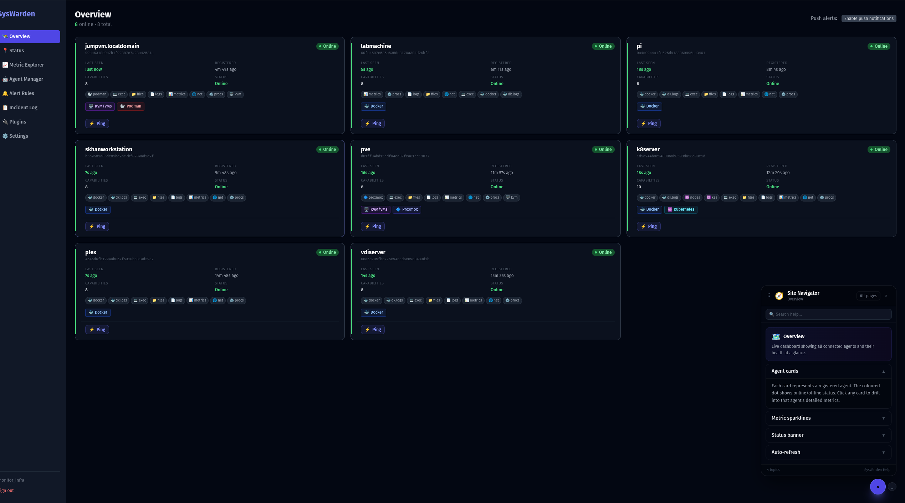
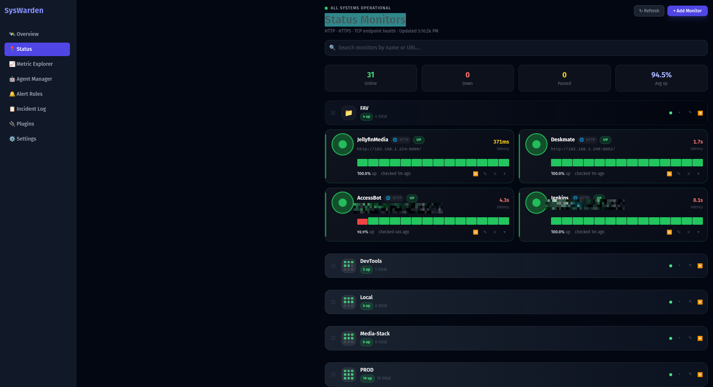
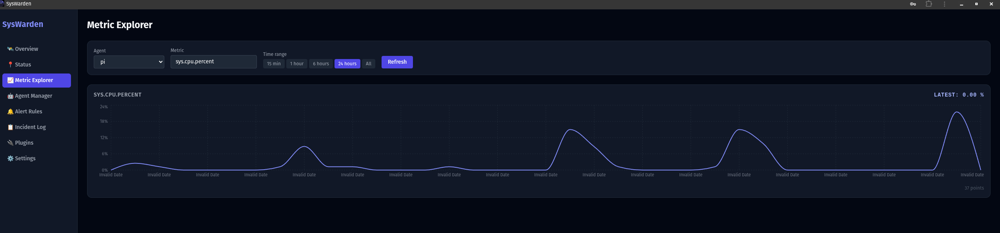
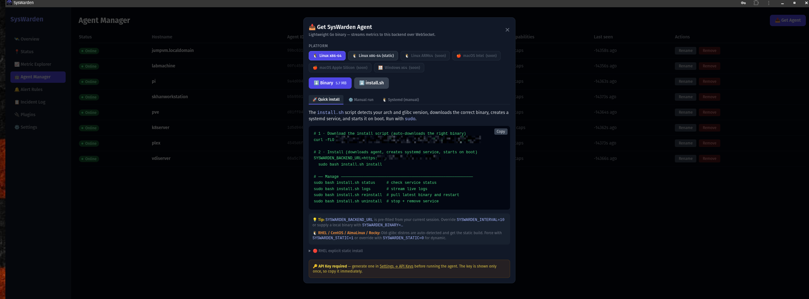
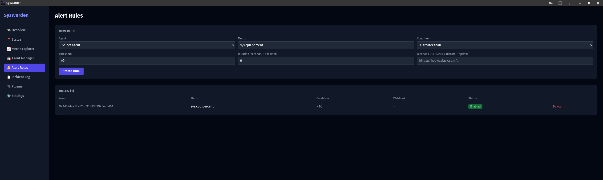
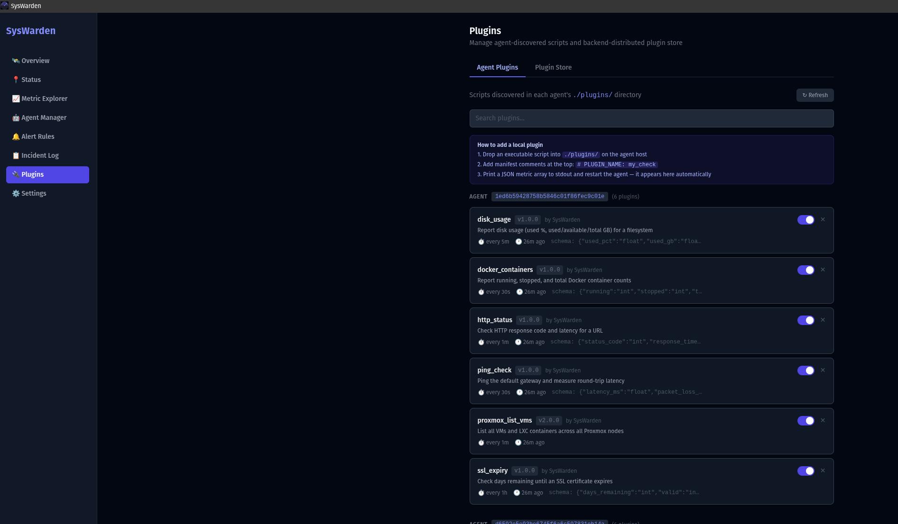
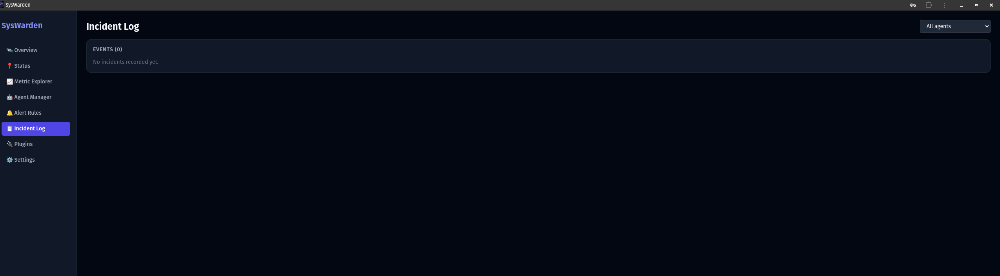
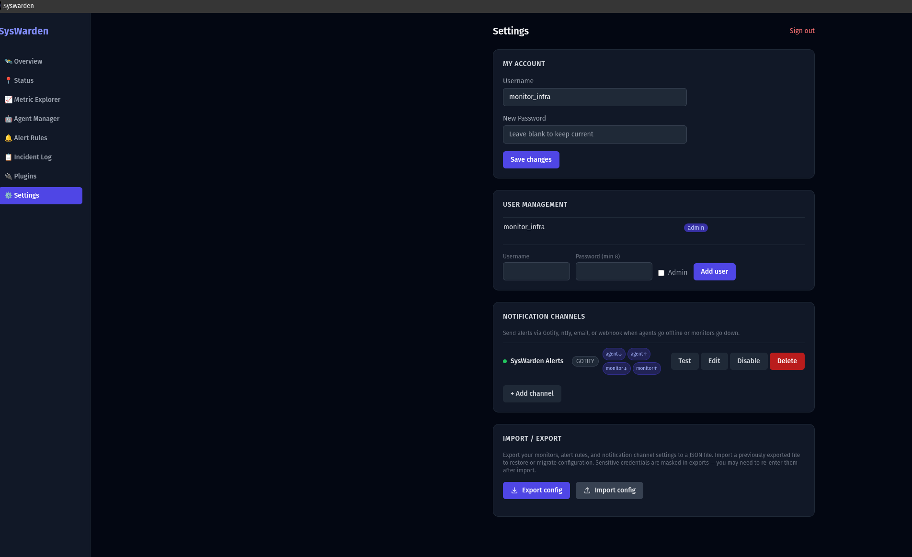

# SysWarden 🛰️

A modular, self-hosted observability platform. Deploy a lightweight agent on any host — SysWarden collects metrics, relays capability commands, evaluates alert rules, runs dynamic plugin scripts, and surfaces everything in a live dashboard.

> Inspired by AWS CloudWatch, Uptime Kuma, and Grafana.

**This is an actively growing project.** Features, capabilities, and documentation are continuously being expanded.

📖 **[Full documentation & product page →](https://sohaib1khan.github.io/SysWarden-Dashboard/)**

---

## Screenshots

| Overview | Status Monitors |
|---|---|
|  |  |

| Metric Explorer | Agent Manager |
|---|---|
|  |  |

| Alert Rules | Plugins |
|---|---|
|  |  |

| Incident Log | Settings |
|---|---|
|  |  |

---

## How It Works

```
┌─────────────────────────────────────────────────────────────────────┐
│  Your Network                                                        │
│                                                                      │
│   ┌──────────────────┐                                               │
│   │   Host A         │                                               │
│   │  ┌────────────┐  │   WebSocket (metrics + capabilities)          │
│   │  │  Agent     │  │ ─────────────────────────────────────────┐    │
│   │  └────────────┘  │                                          │    │
│   └──────────────────┘                                          │    │
│                                                          ┌───────▼──────────┐
│   ┌──────────────────┐                                   │                  │
│   │   Host B         │   WebSocket                       │  FastAPI Backend │
│   │  ┌────────────┐  │ ─────────────────────────────────►│  :8000           │
│   │  │  Agent     │  │                                   │                  │
│   │  └────────────┘  │                                   │  - REST API      │
│   └──────────────────┘                                   │  - WS Relay      │
│                                                          │  - Alert Engine  │
│   ┌──────────────────┐                                   │  - Plugin Store  │
│   │   Host C (Pi,    │   WebSocket                       │  - Metric Ingest │
│   │   RHEL, Docker)  │ ─────────────────────────────────►│                  │
│   │  ┌────────────┐  │                                   └───────┬──────────┘
│   │  │  Agent     │  │                                           │
│   │  └────────────┘  │                                           │ REST
│   └──────────────────┘                                   ┌───────▼──────────┐
│                                                          │   nginx +        │
│                                                          │   React Dashboard│
│                                                          │   :5173          │
│                                                          └──────────────────┘
└─────────────────────────────────────────────────────────────────────┘
```

**Data flow:**

1. Each agent connects to the backend over a persistent WebSocket on startup
2. Agents self-register on first run — credentials are persisted to `~/.syswarden/agent.key`
3. Agents push metric data on a configurable interval (default: every 10 seconds)
4. The dashboard can request on-demand data from any agent via the backend relay — the agent executes the capability and returns the result in real time
5. The backend evaluates alert rules on every metric ingest and fires notifications when thresholds are breached
6. Agents poll the backend Plugin Store every 60 seconds — new or updated scripts are downloaded and activated without restarting the agent

---

## Features

**Agent**
- Single static binary — runs on any Linux host regardless of glibc version
- Self-registers on first run, reconnects automatically on disconnect
- Streams system metrics over WebSocket: CPU, memory, disk, network
- Responds to on-demand capability requests from the dashboard
- Capabilities: processes, log tailing, file reads, shell exec, network checks, Docker, Kubernetes, KVM/Proxmox
- Plugin system: drop a script into `./plugins/` and it becomes a live metric
- Auto-syncs plugin scripts from the backend Plugin Store every 60 seconds

**Backend**
- REST API with WebSocket relay for bidirectional agent communication
- Metric ingestion and time-series storage
- Alert rule engine — threshold-based rules with configurable duration windows
- Notification channels: Gotify, ntfy, webhook (Slack, Discord), email
- Plugin Store — distribute scripts to all agents without redeploying
- Export / import configuration as JSON
- bcrypt-hashed agent API keys

**Dashboard**
- Live overview of all connected agents with status indicators
- Metric Explorer — pick any agent, any metric, any time range
- Status Monitors — HTTP, HTTPS, and TCP endpoint health checks with uptime history
- Alert Rules management and Incident Log
- Agent Manager — one-click install instructions per platform
- Plugin management — Agent Plugins and Plugin Store tabs
- PWA support — installable on mobile, push notifications
- User management with admin roles

---

## Quick Start

### Server

```bash
git clone https://github.com/sohaib1khan/SysWarden.git
cd SysWarden
bash scripts/setup.sh
```

`setup.sh` generates a secure `SECRET_KEY`, detects your LAN IP, writes `.env`, and starts the stack via Docker Compose. Open the printed URL to complete first-run setup.

> Skip all prompts: `bash scripts/setup.sh --yes`

| Service | URL | Purpose |
|---|---|---|
| Dashboard | `http://<your-ip>:5173` | Web UI |
| Backend | `http://<your-ip>:8000` | API + WebSocket relay |
| API Docs | `http://<your-ip>:8000/docs` | Swagger UI |

### Agent

Once the server is running, install the agent on each machine you want to monitor:

```bash
SYSWARDEN_BACKEND_URL=http://<server-ip>:8000 sudo bash scripts/install.sh install
```

The install script auto-detects architecture and glibc version, installs the correct binary, and registers a systemd service that starts on boot. The agent appears in the dashboard within seconds.

**Manage the agent service:**

```bash
sudo bash scripts/install.sh status      # check status
sudo bash scripts/install.sh logs        # tail live logs
sudo bash scripts/install.sh reinstall   # pull latest binary and restart
sudo bash scripts/install.sh uninstall   # stop and remove everything
```

> RHEL / CentOS / AlmaLinux / Rocky: the static binary is selected automatically.
> Force it manually: `SYSWARDEN_STATIC=1 SYSWARDEN_BACKEND_URL=... sudo bash install.sh install`

---

## Agent Deployment Methods

The agent is a single statically-linked binary (~10 MB). Choose the method that fits your environment.

### Method 1 — Install script (recommended)

No Go required on the target machine. Downloads the correct binary from your server and installs a systemd service automatically.

```bash
SYSWARDEN_BACKEND_URL=http://<server-ip>:8000 sudo bash scripts/install.sh install
```

Or pipe it directly without cloning the repo:

```bash
curl -fsSL http://<server-ip>:8000/api/v1/agent/download/install.sh | \
  SYSWARDEN_BACKEND_URL=http://<server-ip>:8000 sudo bash -s install
```

### Method 2 — Docker

```bash
docker build -t syswarden-agent ./agent

docker run -d \
  --name syswarden-agent \
  --restart unless-stopped \
  -e SYSWARDEN_BACKEND_URL=http://<server-ip>:8000 \
  -v syswarden-agent-data:/root/.syswarden \
  syswarden-agent
```

For host-level metrics, add `--pid=host --network=host -v /proc:/proc:ro -v /sys:/sys:ro`.

### Method 3 — Docker Compose (agent on same machine as server)

```bash
docker compose --profile agent up -d
```

### Method 4 — Cross-compile and SCP

Build for any target from your local machine:

```bash
# Linux amd64
GOOS=linux GOARCH=amd64 CGO_ENABLED=0 go build -o agent-linux-amd64 ./cmd/agent

# Linux arm64 (Raspberry Pi 4, Graviton)
GOOS=linux GOARCH=arm64 CGO_ENABLED=0 go build -o agent-linux-arm64 ./cmd/agent

# Linux armv7 (Raspberry Pi 2/3)
GOOS=linux GOARCH=arm GOARM=7 CGO_ENABLED=0 go build -o agent-linux-armv7 ./cmd/agent
```

### Method 5 — Ansible (fleet deployment)

```yaml
- name: Deploy SysWarden agent
  hosts: monitored_servers
  become: true
  vars:
    backend_url: "http://<server-ip>:8000"
    agent_binary_src: "data/agent-bin/agent-linux-amd64"
  tasks:
    - name: Copy agent binary
      copy:
        src: "{{ agent_binary_src }}"
        dest: /usr/local/bin/syswarden-agent
        mode: "0755"
    - name: Install systemd service
      copy:
        dest: /etc/systemd/system/syswarden-agent.service
        content: |
          [Unit]
          Description=SysWarden Agent
          After=network-online.target
          [Service]
          Type=simple
          Environment="SYSWARDEN_BACKEND_URL={{ backend_url }}"
          ExecStart=/usr/local/bin/syswarden-agent
          Restart=always
          RestartSec=15
          [Install]
          WantedBy=multi-user.target
    - name: Enable and start agent
      systemd:
        name: syswarden-agent
        enabled: true
        state: started
        daemon_reload: true
```

---

## Agent Configuration

All settings are environment variables — no config file required.

| Variable | Default | Description |
|---|---|---|
| `SYSWARDEN_BACKEND_URL` | `http://localhost:8000` | Backend base URL |
| `SYSWARDEN_INTERVAL` | `10` | Metric push interval in seconds |
| `SYSWARDEN_AGENT_ID` | _(auto after registration)_ | Inject to skip re-registration |
| `SYSWARDEN_API_KEY` | _(auto after registration)_ | Inject to skip re-registration |
| `SYSWARDEN_KEY_FILE` | `~/.syswarden/agent.key` | Path to credentials file |
| `SYSWARDEN_PLUGINS_DIR` | `./plugins` | Directory scanned for plugin scripts |

---

## Plugins

### Writing a plugin

Drop any executable script into the agent's `./plugins/` directory with manifest headers:

```bash
#!/bin/bash
# PLUGIN_NAME: my_check
# PLUGIN_VERSION: 1.0.0
# PLUGIN_DESCRIPTION: What this plugin does
# PLUGIN_INTERVAL: 30
# PLUGIN_AUTHOR: yourname
# PLUGIN_OUTPUT_SCHEMA: {"value":"float"}

echo '[{"name": "my_check.value", "value": 42, "unit": "ms"}]'
```

For **on-demand capability plugins**, add:

```bash
# PLUGIN_TYPE: capability
# PLUGIN_CAPABILITY: custom.my_check
```

### Plugin Store (backend-distributed)

Scripts added via **Plugins → Plugin Store** in the dashboard are automatically synced to every connected agent every 60 seconds — no restart or redeploy needed.

The agent compares SHA-256 checksums on each poll, downloads changed scripts, and registers capability-type plugins as live handlers immediately.

---

## Project Structure

```
SysWarden/
├── agent/                  # Go — deployable agent binary
│   ├── cmd/agent/          # Entrypoint
│   ├── internal/
│   │   ├── capabilities/   # sys.metrics, docker, kubernetes, virt, exec, logs...
│   │   ├── config/         # Config loading, allowlist
│   │   ├── plugins/        # Plugin loader and runner
│   │   └── relay/          # WebSocket client, HTTP client, handlers
│   └── plugins/            # Built-in plugin scripts
├── backend/                # Python FastAPI — API server
│   └── app/
│       ├── api/v1/         # Route handlers per domain
│       ├── core/           # Relay broker, alert evaluator, notifier
│       ├── models/         # Database models
│       ├── repositories/   # Data access layer
│       └── schemas/        # Request/response shapes
├── dashboard/              # React + Tailwind — web UI
│   └── src/
│       ├── api/            # Backend API call wrappers
│       ├── components/     # Reusable UI components
│       ├── hooks/          # Custom React hooks
│       ├── pages/          # One file per route
│       └── store/          # Global state
├── docs/
│   ├── index.html          # GitHub Pages product page
│   └── api-contract.md     # Full API reference
├── img/                    # Screenshots
├── plugins/                # Shared plugin scripts
└── scripts/
    ├── setup.sh            # One-command server setup
    ├── install.sh          # Agent installer
    └── gen-api-key.py      # Utility — generate standalone API key
```

---

## Development Setup

Run each component locally without Docker:

```bash
# Backend
cd backend
pip install -r requirements.txt
cp ../.env.example .env
uvicorn app.main:app --reload

# Dashboard
cd dashboard
npm install
npm run dev

# Agent
cd agent
go run ./cmd/agent
```

---

## Security Notes

- Agent API keys are bcrypt-hashed at rest. The plaintext is shown once at registration and written to `~/.syswarden/agent.key`.
- `sys.exec` requires an explicit allowlist on the agent — arbitrary remote execution is disabled by default.
- CORS, rate limiting, and request size caps are enforced on all ingest endpoints.
- The nginx container proxies `/api/*` to the backend — port `8000` can be firewalled from the public internet.
- Never commit `.env`. Generate `SECRET_KEY` with: `python3 -c "import secrets; print(secrets.token_hex(32))"`

---

## Roadmap

This is a continuously growing project. Planned additions include:

- [ ] macOS and Windows agent support
- [ ] Multi-user role permissions (read-only viewer)
- [ ] Public status page (shareable uptime page)
- [ ] Metric retention policies and data pruning
- [ ] Expanded Kubernetes and Proxmox capability coverage
- [ ] Mobile app via TWA (Google Play Store)
- [ ] Grafana-compatible metric export

Contributions and feedback welcome — open an issue or submit a pull request.